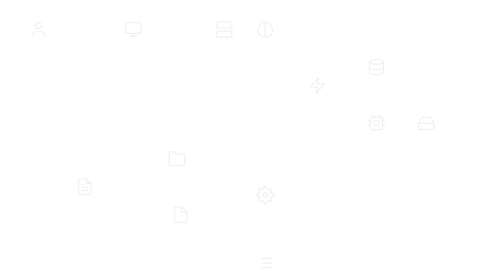

# HR Policy RAG Assistant (GPT2 + FAISS)

A Retrieval-Augmented Generation (RAG) system for querying HR policies using a fine-tuned GPT-2 model and FAISS vector search. This project extracts text from policy documents (PDF, DOCX, TXT), builds a FAISS index for efficient retrieval, and provides a user-friendly Streamlit interface with a chat-like UI for answering policy-related questions.

## Features
- **Document Processing**: Extracts text from HR policy files (PDF, DOCX, TXT) and chunks them for retrieval.
- **Vector Search**: Uses FAISS and SentenceTransformers (`all-MiniLM-L6-v2`) for fast, semantic retrieval of relevant policy snippets.
- **Fine-Tuned GPT-2**: Generates contextual answers using a fine-tuned GPT-2 model trained on policy data. **no open api key required**
- **FastAPI Backend**: Serves a RESTful API (`/query`) for querying the RAG pipeline.
- **Streamlit UI**: A clean, white-themed chat interface with loading spinner and larger fonts, mimicking a modern assistant like Grok.
- **Robust Error Handling**: Includes timeout handling, disabled buttons during processing, and clear feedback for users.

## Tech Stack
- **Python**: Core language for processing, training, and serving.
- **Transformers**: Fine-tunes GPT-2 for text generation (`traingpt2.py`).
- **SentenceTransformers & FAISS**: Embeds and retrieves policy chunks (`readdata.py`).
- **FastAPI**: Powers the API backend (`api.py`).
- **Streamlit**: Builds the interactive frontend (`app.py`).
- **PyPDF2, python-docx**: Extracts text from PDF and DOCX files.

## Architecture
Below is the high-level architecture diagram of the HR Policy RAG system:



## Setup
1. **Clone the Repository**:
   ```bash
   git clone https://github.com/your-username/hr-policy-rag-assistant.git
   cd hr-policy-rag-assistant
   ```

2. **Install Dependencies**:
   ```bash
   pip install -r requirements.txt
   ```
   (Create `requirements.txt` with: `fastapi`, `uvicorn`, `streamlit`, `requests`, `sentence-transformers`, `transformers`, `torch`, `faiss-cpu`, `PyPDF2`, `python-docx`, `datasets`)

3. **Prepare Policy Documents**:
   - Place HR policy files (`.pdf`, `.docx`, `.txt`) in a `policies/` folder.

4. **Build FAISS Index**:
   ```bash
   python readdata.py
   ```
   Generates `faiss_index.index`, `chunks.pkl`, and `policies.txt`.

5. **Fine-Tune GPT-2**:
   ```bash
   python traingpt2.py
   ```
   Outputs fine-tuned model to `trainedmodelfinetuned/`.

6. **Run FastAPI Backend**:
   ```bash
   python api.py
   ```
   or
   ```bash
   uvicorn api:app --host 0.0.0.0 --port 8000 --reload
   ```

7. **Run Streamlit Frontend**:
   ```bash
   streamlit run app.py
   ```
   Access at `http://localhost:8501`.

## Usage
- Open the Streamlit UI (`http://localhost:8501`).
- Enter a query (e.g., "What is the company policy on remote work?").
- The system retrieves relevant policy chunks via FAISS and generates an answer using GPT-2.
- A loading spinner displays during processing, and buttons disable to prevent duplicate requests.

## Project Structure
- `readdata.py`: Extracts text, chunks documents, and builds FAISS index.
- `traingpt2.py`: Fine-tunes GPT-2 on policy data using the `datasets` library.
- `api.py`: FastAPI backend for RAG queries.
- `app.py`: Streamlit frontend with a chat-like UI.
- `.gitignore`: Excludes model weights, data files, and caches.

## Notes
- The GPT-2 model may produce less coherent responses compared to larger models. Consider `gpt2-medium` for better quality (update `traingpt2.py`).
- Timeout is set to 60 seconds in `app.py`; adjust for slower hardware.
- Sensitive policy data is ignored via `.gitignore` to prevent accidental commits.

## Future Improvements
- Support larger models (e.g., LLaMA, Mistral) via Hugging Face.
- Add query parameter controls (e.g., `k`, `temperature`) in the Streamlit UI.
- Optimize FAISS retrieval for larger document sets.
- Deploy API and UI to cloud services (e.g., AWS, Heroku).

## License
MIT License
